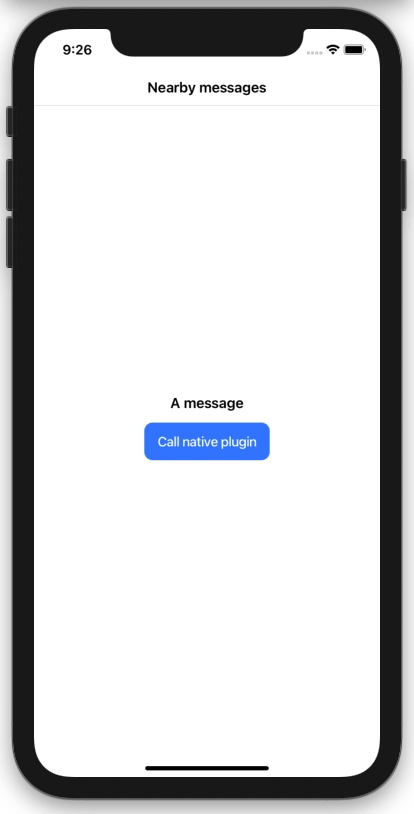
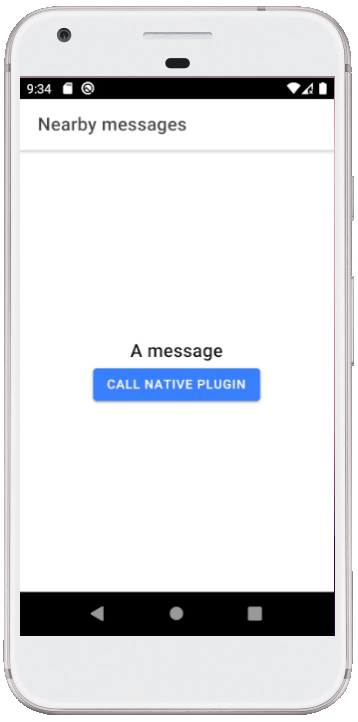

# Cross platform Ionic native plugin tutorials

If you haven't used Ionic before, you'll need to download the CLI tool.

`npm install -g @ionic/cli`

Then start a new project called 'bt-messages' in your working directory (you can call it whatever you want).

`ionic start bt-messages`

With Ionic, you can develop in Angular, React, Vue, or plain JS - I chose React.

Once we've generated our app, we can view it in a browser.

`cd bt-messages && ionic serve`

I'm using Capacitor (rather than `Cordova`), which builds native Android and iOS projects from a single codebase, allowing me to directly write some native code (in Java and Swift) in each native project; I'll then register my native code as a _plugin_ with Capacitor so I can call my native code from my React app where I'm writing the business logic.

To add Android and iOS to our project using Capacitor we run:

`npm run build`

`ionic cap add android`

`ionic cap add ios`

The `/src` directory of our project holds the source code for our cross-platform app. We can use Capacitor to compile this into native projects when we make changes to our source code by running:

`ionic cap copy`

We now have our project set up to add a plugin.

## Writing a simple native plugin.

There are three main steps to writing a plugin:

- (iOS & Android) Write a class which holds the native code we want to run (our plugin).
- (iOS & Android) Register this class as a plugin with Capacitor.
- (Javascript - Ionic) Import and call the methods of our plugin.

Let's start by creating a local native plugin called `NearbyMessagesPlugin` and add a simple `HelloWorld` method to test that our Javascript can call native functions. The method is going to resolve the call by sending back a JSON with a `message` attribute.

**Android**

Open the `/android` directory of your project in Android Studio.

In `android/app/src/main/java/io/ionic/starter` of your project (next to `MainActivity.java`), we can create a new file called `NearbyMessagesPlugin.java` and write a class which extends the Capacitor `Plugin` class:

```
package io.ionic.starter;

import com.getcapacitor.JSObject;
import com.getcapacitor.NativePlugin;
import com.getcapacitor.Plugin;
import com.getcapacitor.PluginCall;
import com.getcapacitor.PluginMethod;

@NativePlugin()
public class NearbyMessagesPlugin extends Plugin {

    @PluginMethod
    public void HelloWorld(PluginCall call){
        JSObject ret = new JSObject();
        ret.put("message", "Hello Android user!");
        call.success(ret);
    }
}
```

Next, we can register this plugin in `MainActivity.java` where Capacitor initialises its bridge:

```
// Initializes the Bridge
this.init(savedInstanceState, new ArrayList<Class<? extends Plugin>>() {{
    add(io.ionic.starter.NearbyMessagePlugin.class);
}});
```

We can run our project like any other native Android project, by pressing the 'play' button in Adroid Studio.

**iOS**

Open the `ios/App` directory of your project in Xcode.

In our `App/App` directory we can create a new swift file called `NearbyMessagesPlugin.swift` which will hold our plugin class with our `HelloWorld` method.

```
import Capacitor

@objc(NearbyMessagesPlugin)
public class NearbyMessagesPlugin: CAPPlugin {

  @objc func HelloWorld(_ call: CAPPluginCall) {
    call.success([
        "message": "Hello iOS user!"
    ])
  }

}
```

Next, we must register our plugin in a new file called `NearbyMessagesPlugin.m`. When prompted by Xcode, create a Bridging Header file (which is an empty file called `App-Bridging-Header.h`).

```
#import <Capacitor/Capacitor.h>

CAP_PLUGIN(NearbyMessagesPlugin, "NearbyMessagesPlugin",
  CAP_PLUGIN_METHOD(HelloWorld, CAPPluginReturnPromise);
)
```

We can run our project like any other native iOS project, by pressing the 'play' button in Xcode.

**Javascript**

Finally, we can now access the plugins we have written from our Ionic project. We import `Plugins` from Capacitor to find the plugin we have registered in Android and iOS.

```
import { Plugins } from "@capacitor/core";
...
// inside the body of our functional component
const { NearbyMessagesPlugin } = Plugins;
```

Now we can call the methods in our plugin and access the native code:

```
// inside the body of our functional component
const result = await NearbyMessagesPlugin.HelloWorld();
console.log(result.message)
```

We now have a cross-platform app set up ready to write a native implementation of Google's Nearby Messages API.



